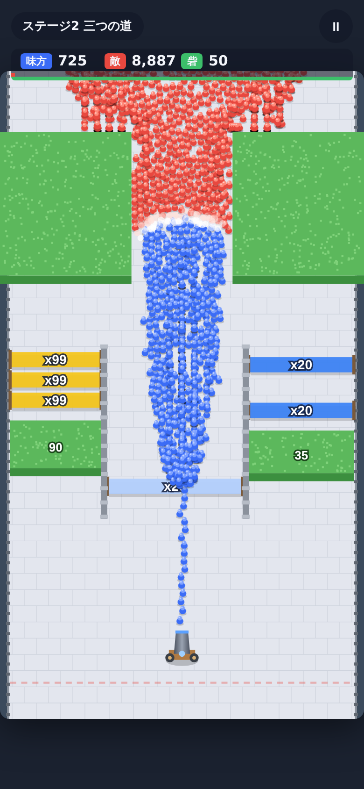
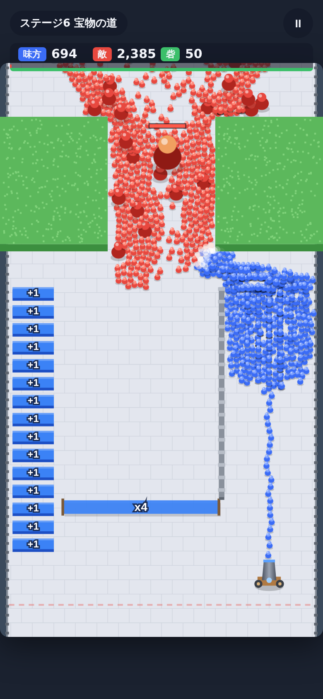
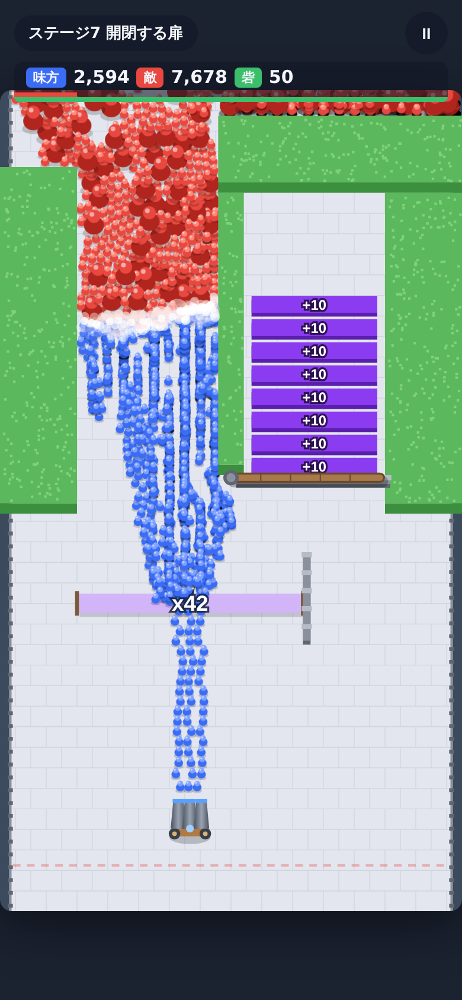

# 群勢キャノン（Crowd Cannon）

砲台から兵を撃ち出し、**倍率の門（x20 / x99 / +10 …）** をくぐらせて兵を増やし、
上から押し寄せる赤の大軍を食い止める、縦画面のブラウザゲームです。

  

- ビルド不要・外部ライブラリなし（HTML5 Canvas + 素の JavaScript）
- スマホ（タッチ）／PC（マウス・キーボード）対応
- 全7ステージ。クリア状況はブラウザの localStorage に保存

## 遊び方

| 操作 | スマホ | PC |
| --- | --- | --- |
| 発射 | 画面を押し続ける | クリック長押し / スペース |
| 砲台の移動 | 左右にドラッグ | ドラッグ / ← → / A D |

- 兵が門を **下から上へ** くぐると、その門の倍率で増えます（同じ門は1人1回まで）
- 緑の **生け垣** や縞模様の **バリケード** は兵の体当たりで削れます（数字が残り耐久）。奥に強い門が隠れていることも
- **ボーナスブロック**（+1 / +99 の四角いブロック）は、最初に触れた1回だけ兵が増えて消えます
- **開閉する扉** は2本の道を交互にふさぎます。紫の道が開いている間は「+10」の帯が流れてきて、門の倍率に加算されます
- **岩に封印された砲台** を壊すと、1回で3人撃てる砲台になります
- 赤い兵と青い兵は1対1で相打ち。**巨人** は12発当てないと倒れません
- 赤い兵が点線（防衛ライン）を越えると砦の耐久が減り、0になると負け
- 敵を全滅させればクリア

## 起動方法

`index.html` をブラウザで直接開くだけで遊べます。スマホ実機で試す場合はローカルサーバーを立ててください。

```bash
cd crowd_cannon
python3 -m http.server 8080
# → http://<PCのIP>:8080 をスマホで開く
```

## テスト

ゲームロジック（`src/sim.js`）は描画から分離してあり、Node.js でテストできます。

```bash
node --test crowd_cannon/test/*.test.js
```

## ファイル構成

```
crowd_cannon/
├── index.html      画面（HUD・タイトル・ステージ選択・リザルト）
├── style.css
├── src/
│   ├── sim.js      ゲームロジック（兵の移動・門・生け垣・戦闘・勝敗）
│   ├── levels.js   ステージ定義（障害物・門・敵の数）
│   ├── render.js   Canvas 描画
│   └── main.js     入力・ゲームループ・画面遷移
└── test/
    └── sim.test.js
```

## ステージの追加

`src/levels.js` の `LEVELS` 配列に追加します。座標は幅360×高さ640の論理座標です。

```js
{
  name: 'ステージ名',
  hint: '開始時に表示するヒント',
  enemies: { total: 5000, initial: 1500, rate: 90, giantEvery: 20,  // 総数・初期配置・毎秒の増援・巨人の頻度
             bosses: [{ x: 180, y: -40, hp: 150 }] },              // ボス（省略可）
  obstacles: [
    { kind: 'bush', x: 0, y: 60, w: 130, h: 150 },          // 壊せない植え込み
    { kind: 'fence', x: 177, y: 250, w: 6, h: 210 },        // 柵
    { kind: 'hedge', x: 183, y: 395, w: 167, h: 55, hp: 80 }, // 壊せる生け垣
    { kind: 'barricade', x: 250, y: 462, w: 100, h: 22, hp: 70 }, // 壊せるバリケード（見た目違い）
    { kind: 'crate', x: 262, y: 372, w: 70, h: 52, hp: 60, reward: 'multishot', shots: 3 }, // 岩の砲台
  ],
  pickups: [
    { x: 266, y: 432, w: 68, h: 12, value: 99 },            // 1回だけ +99 のボーナスブロック
  ],
  // 支点(px,py)・長さ len の扉。angles[0] で hold[0] 秒 → swing 秒で振れる → angles[1] で hold[1] 秒…を繰り返す
  doors: [{ px: 180, py: 302, len: 116, angles: [0, Math.PI], hold: [8, 4], swing: 1.2 }],
  // 扉の向こうから流れてくる「+10」の帯。開いている間だけ下って gate 番目の門の倍率に加算
  feeders: [{ x0: 190, x1: 300, count: 12, startY: 282, spacing: 18, speed: 15, releaseY: 318, gate: 0, add: 10, door: 0 }],
  gates: [
    { x0: 10, x1: 177, y: 430, type: 'mul', value: 3 },     // x3
    { x0: 183, x1: 350, y: 320, type: 'add', value: 10 },   // +10
    { x0: 120, x1: 240, y: 360, type: 'mul', value: 10, move: { range: 100, speed: 0.12 } }, // 左右に動く門
  ],
}
```
