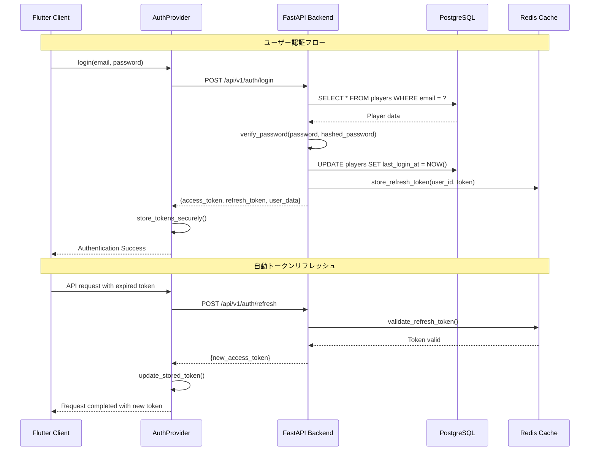
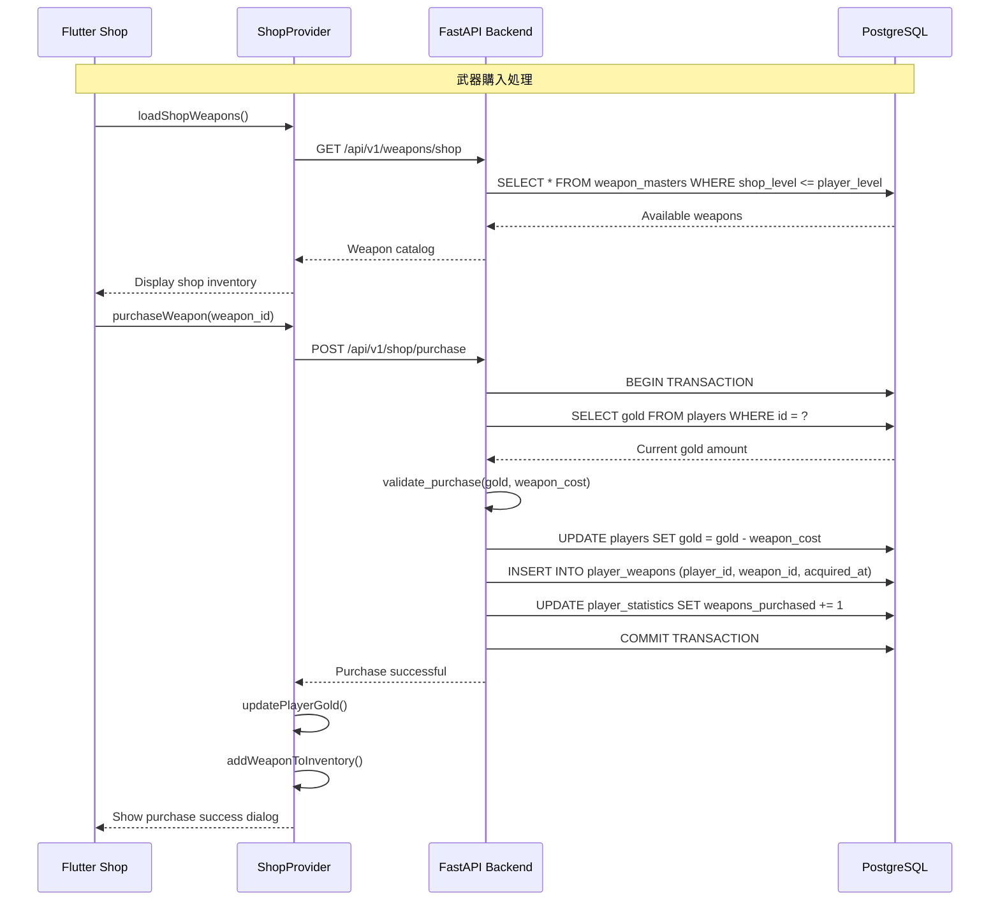
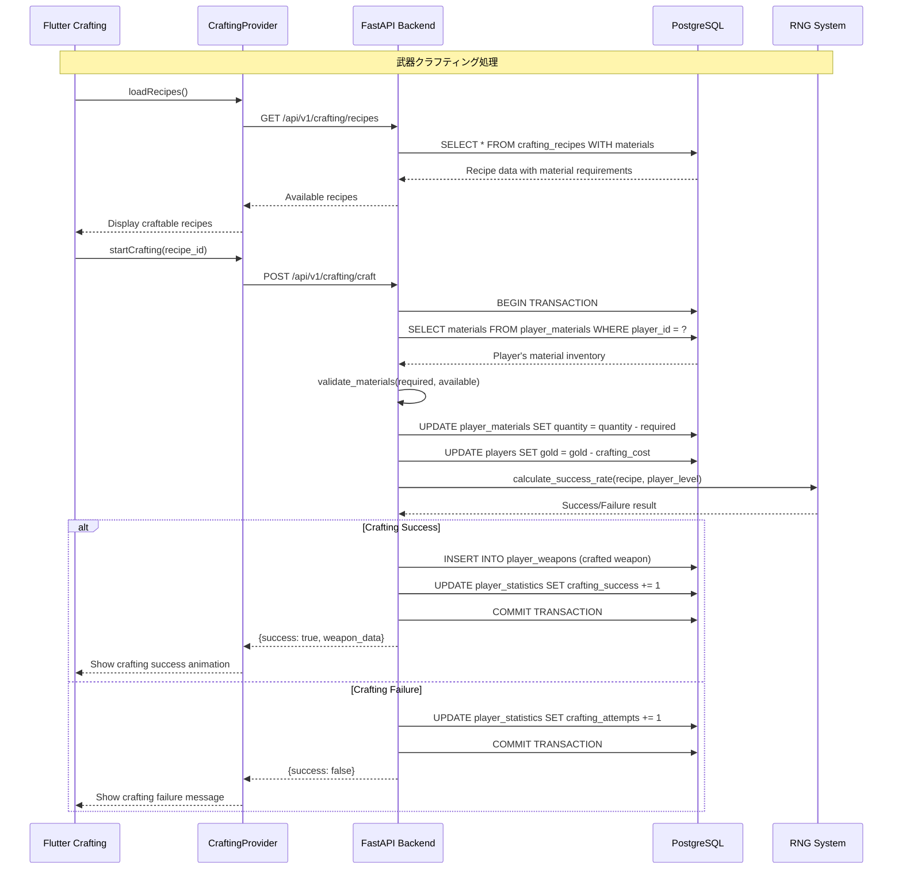
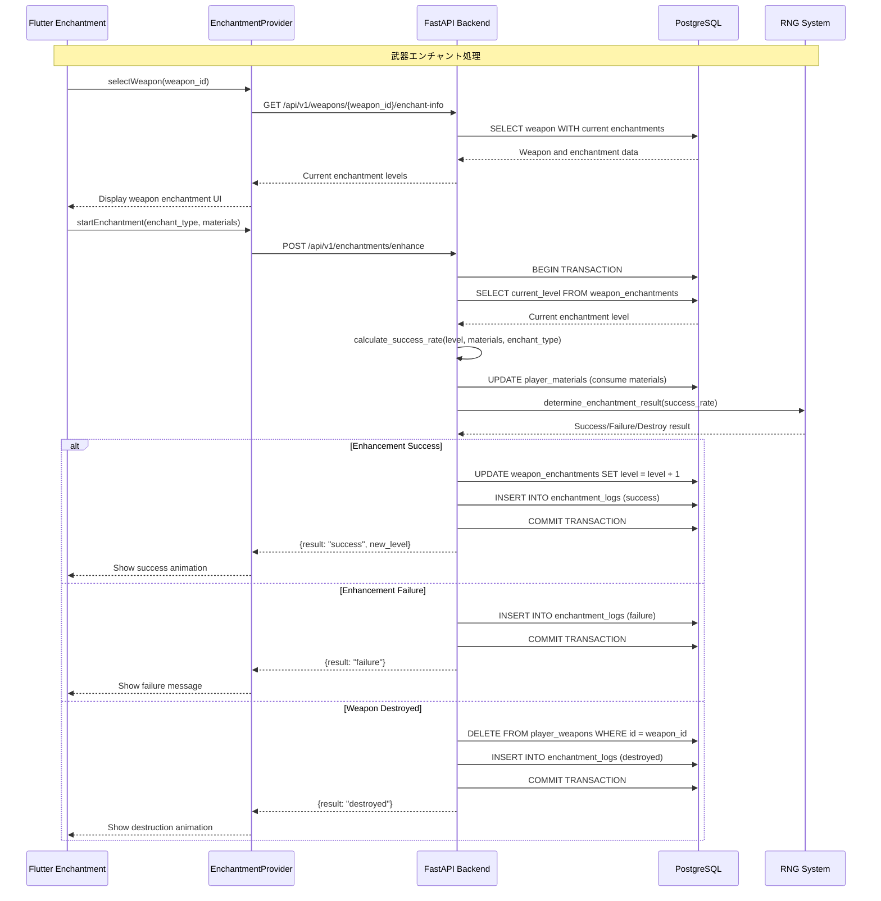
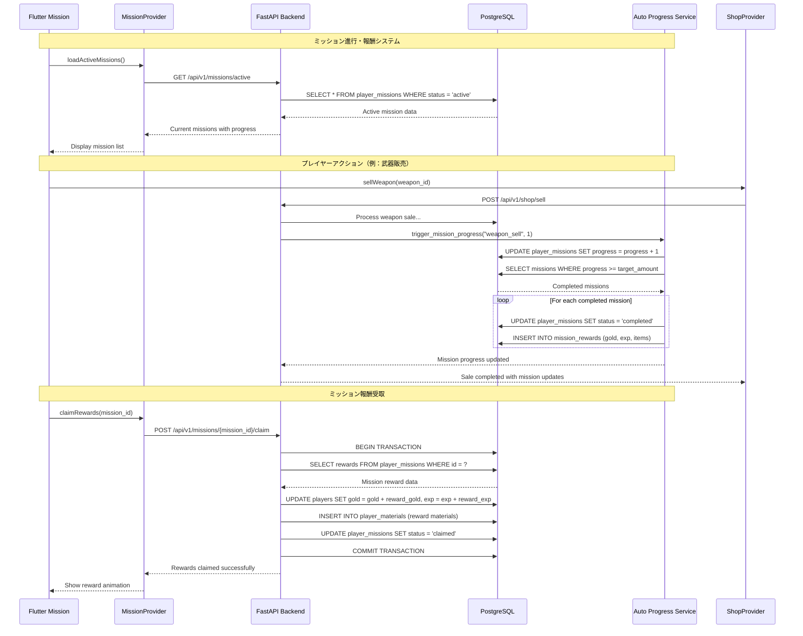
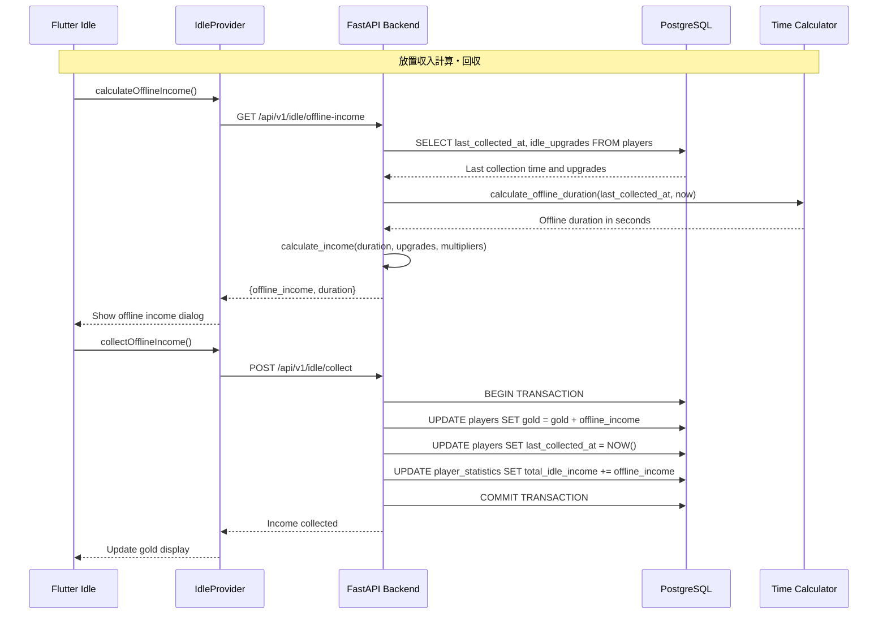
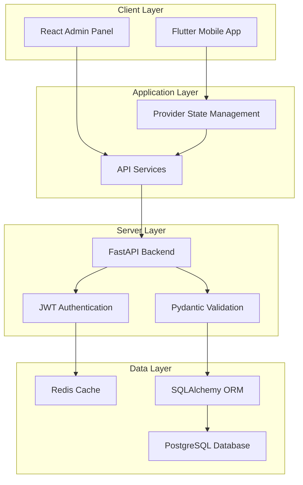

# 武器屋放置ゲーム - 処理シーケンス図

このファイルは武器屋放置ゲームの主要な処理フローをMermaid記法で表現したシーケンス図です。

## 1. 認証フロー（ログイン・登録）

## 2. 武器購入フロー

## 3. クラフティング（武器作成）フロー

## 4. エンチャント（武器強化）フロー

## 5. ミッション進行フロー

## 6. 放置収入システムフロー

## システム全体のアーキテクチャ概要

